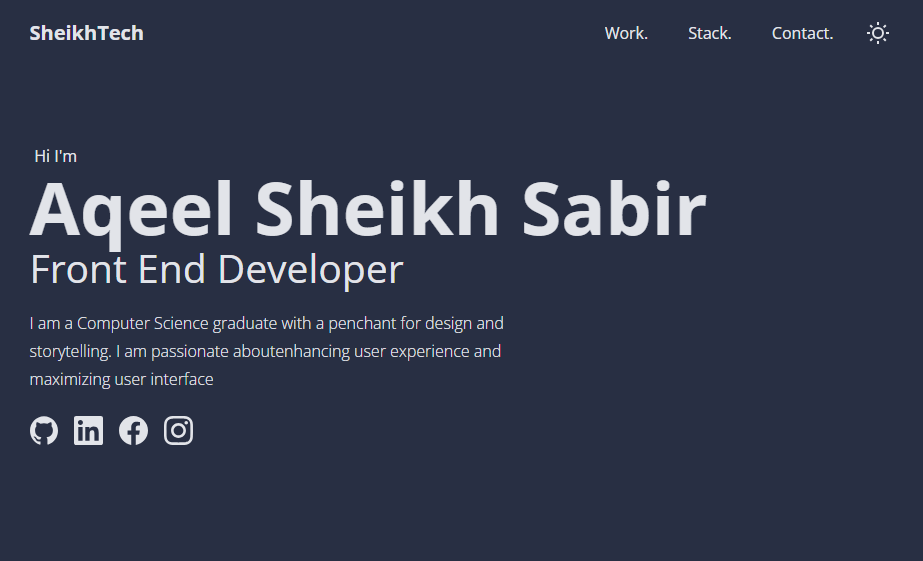

<div id="top"></div>


# Sheikhtech
# Sheikhtech is a Minimal Portfolio Template built with React and Vite, easy to use 




## Prerequisites

Install NPM or PNPM
* npm
  ```sh
  npm install npm@latest -g
  ```
 
  Or
  
* pnpm
  ```sh
  npm install -g pnpm
  ```


## Setup

   
2. Install NPM packages
   ```sh
   npm install
   ```
   
3. Start the development server
   ```sh
   npm run dev
   ```

## Usage


## Build & deploy

1. Generate a full static production build
   ```sh
   npm run build
   ```
   
2. Preview the site as it will appear once deployed
   ```sh
   npm run preview
   ```

## License

Distributed under the MIT License. See `LICENSE.txt` for more information.

<p align="right">(<a href="#top">back to top</a>)</p># Aqeel_Portfolio
# Aqeel_Portfolio
